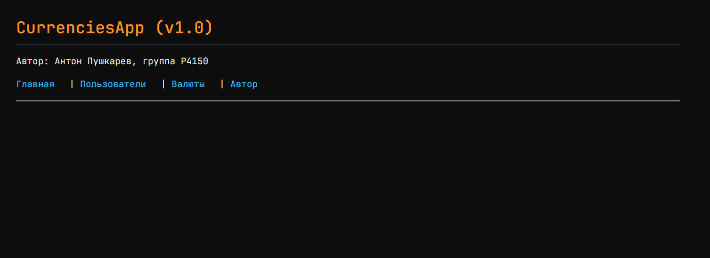
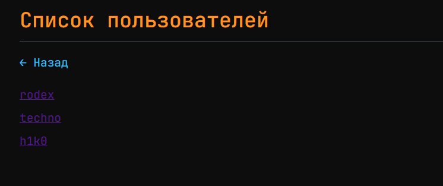
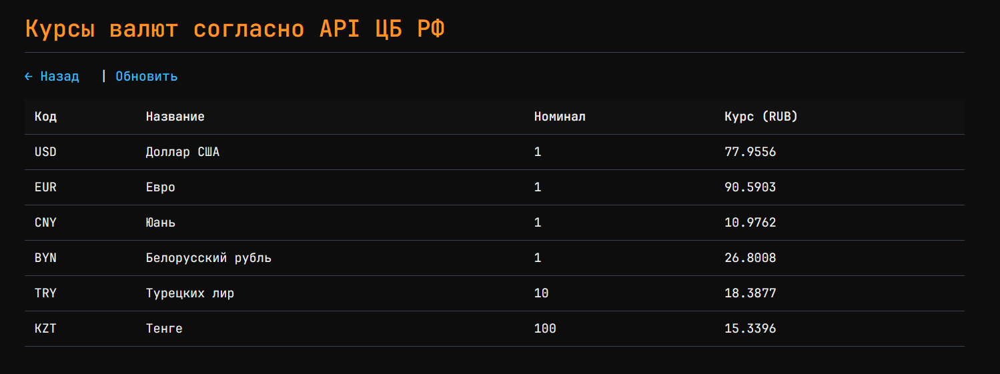
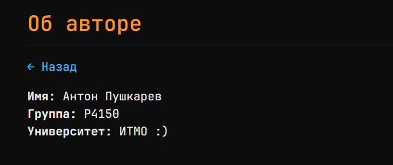
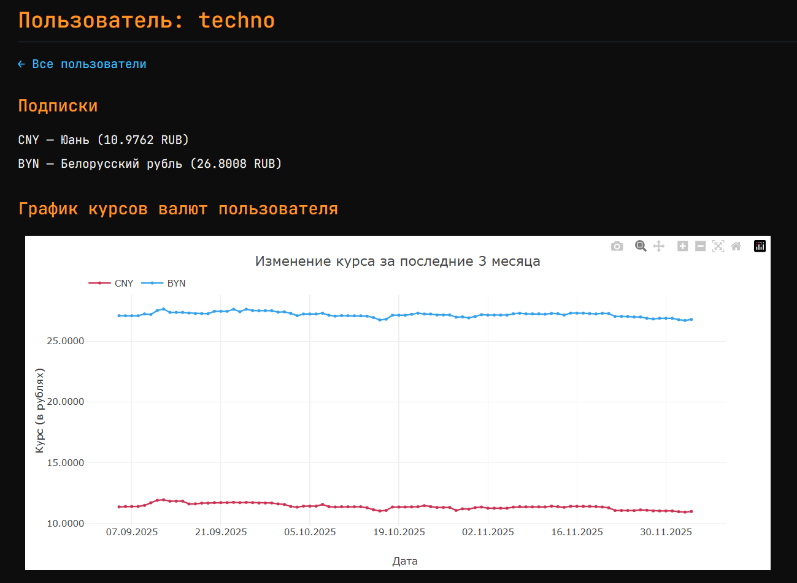
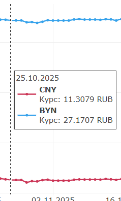
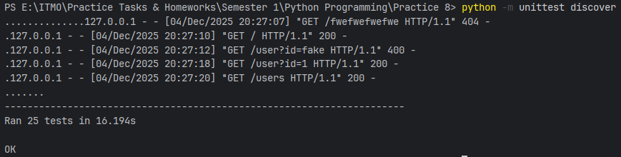

# Отчёт по ЛР №8

> **Работу выполнил:** Пушкарев Антон Дмитриевич, P4150

## Цель работы

Создать клиент-серверное приложение с паттерном MVC, позволяющее просматривать курсы валют, реализовав при этом:

- модели основных сущностей;
- серверный код с маршрутами;
- шаблонизацию страниц;
- интеграцию с API центробанка;
- графическое отображение динамики курсов валют за последние 3 месяца.

## Описание предметной области

- **App** - само приложение, поля: "name" (название - строка), "version" (версия - строка), "author" **(связь 1 к 1 с
  Author)**
- **Author** - автор приложения, поля: "name" (имя - строка), "group" (учебная группа - строка)
- **Currency** - валюта, поля: "id" (натуральное число), "num_code" (цифровой код ЦБ - строка), "char_code" (символьный
  код валюты - строка), "name" (название валюты - строка), "value" (курс валюты - вещ. число), "nominal" (номинал
  валюты - целое число)
- **User** - пользователь приложения, поля: "id" (натуральное число), "name" (имя пользователя - строка)
- **UserCurrency** - валюта пользователя **(реализация связи "многие-ко-многим")**, поля: "id" (идентификатор связи,
  натуральное число), "user_id" (идентификатор пользователя - натуральное число), "currency_id" (идентификатор валюты -
  натуральное число)

## Структура проекта

```bash
Practice 8/
├── models/ # директория с моделями предметной области
│ ├── init.py
│ ├── app.py
│ ├── author.py
│ ├── currency.py
│ ├── user.py
│ └── user_currency.py
├── templates/ # views (здесь содержатся шаблоны)
│ ├── author.html # страница об авторе
│ ├── currencies.html # страница со всеми валютами
│ ├── index.html # главная страница
│ ├── user.html # страница с валютами пользователя и графиком изменения курса за последние 3 месяца
│ └── users.html # страница со списком пользователей
├── static/ # статика
│ ├── styles.css # стили
│ └── draw_plot.js # скрипт для построения графика курса валют
├── utils/
│ ├── init.py
│ ├── currencies_api.py # get_currency_data(), get_historical_rates() - интеграция с API ЦБ
├── myapp.py # основной файл, откуда запускается сервер
├── tests/
│ ├── init.py
│ ├── test_models.py # тесты моделей
│ ├── test_currencies_api.py # тесты API
│ ├── test_server.py # тесты маршрутов
│ └── test_templates.py # тесты шаблонов
└── report.md # собственно, этот отчёт
```

## Описание реализации

- Модели реализованы в пакете `models`, в каждой из них присутствует валидация полей; свойства помечаются декоратором
  @property, а геттеры/сеттеры - с помощью @*field_name*.setter/getter

- Для маршрутизации используется BaseHTTPRequestHandler из пакета http.server
    - Поддерживаемые маршруты:
        - "/" - главная страница,
        - "/users" - список пользователей
        - "/user?id=..." - информация о пользователе и его подписках
        - "/currencies" - список валют с текущими курсами
        - "/author" - информация об авторе
        - "/static/..." - статические файлы (скрипты, стили)

- Для шаблонизации используется движок Jinja2 - данные туда передаются из контроллера
    - Environment инициализируется единожды при старте приложения (с указанием пакета; папка templates стоит как
      параметр по умолчанию в этом конструкторе)
      ```python
      env = Environment(
          loader=PackageLoader('Practice 8'),
          autoescape=select_autoescape()
      )
      ```

- Для работы API нужны 2 функции
    - get_currency_data() - принимает список символьных кодов валют и отдаёт данные об их курсах к рублю
    - get_historical_rates() - принимает код валюты и отдаёт данные о курсе за последние дни (так же указывается в
      качестве параметра)

  Первая из этих функций вызывается через обёртку в myapp.py. Обёртка (fetch_currencies()) по сути извлекает данные из
  json и инициализирует модели вида Currency. Вторая же вызывается непосредствено из хэндлера маршрута "/user" без
  обёрток: задача
  состоит в том, чтобы через неофициальную библиотеку cbrapi получить данные о динамике курсов валют.

## Примеры работы приложения

**1) Главная страница ("/")**



Содержит в себе навигацию по основным разделам сайта

**2) Страница со списком всех пользователей ("/users")**



**3) Страница с курсами валют ("/currencies")**



Выводятся все основные данные; при этом, их можно обновить через соответствующую кнопку

**4) Страница с информацией об авторе ("/author")**



Содержатся данные обо мне - авторе проекта

## Самостоятельная работа

Реализована страница с информацией о валютах определённого пользователя ("/user?id=...")**



Отображается график динамики курса валют за последние 90 дней пользователя techno (на графике - юань и белорусский
рубль)



График реализован при помощи библиотеки Plotly.js. Данные, переданные в шаблон через функцию get_historical_rates(),
парсятся таким образом, чтобы по оси X были даты, а по оси Y - непосредственно курсы валют.
Также добавлены подписи к осям, легенда графика, подпись графика и всплывающее окно при наведении на определённую
дату.

## Тестирование

Были проведены тесты основных составляющих приложения:

- API ЦБ;
- моделей;
- сервера (маршрутов);
- шаблонов Jinja2.

Сами тесты расположены в папке tests и задокументированы.
**Результаты тестирования:**



Запуск производился при помощи команды `python -m unittest discover` из директории "Practice 8"

## Выводы

### Проблемы при разработке

1) Из-за того, что Центробанк поддерживает запрос к историческим данным через SOAP, первый мог оказаться достаточно
   громоздким, и поэтому в целях упрощения кода было принято решение использовать библиотеку cbrapi
2) Возникла ошибка с обработкой фигурных скобок при задании данных для шаблона "user"; в целях устранения проблемы
   фильтр 'tojson' был определён как:
   `env.filters['tojson'] = lambda obj: html.escape(json.dumps(obj, ensure_ascii=False))`, а сами данные переданы через
   дата-атрибут `data-historical='{{ historical_data | tojson | safe }}'`
3) По невнимательности тесты запускались интерпретатором версии 3.12, в то время как проект был настроен на Python 3.13;
   пришлось установить библиотеку cbrapi отдельно через _pip install_

### Применение принципов MVC

И модели, и отображения, и контроллер были успешно реализованы в данном проекте. Первое - в папке /models, второе - в
папке /templates, третье - непосредственно в myapp.py. Таким образом, была выстроена базовая архитектура,
соответствующая MVC-паттерну.

### Что нового стало известно

Так как до этого я разрабатывал и клиентские, и серверные веб-приложения с использованием Node.js и фреймворка
Express (+ ещё писал код на FastAPI), то принципиально новых вещей не узнал, однако до этого, во-первых, не приходилось
строить графики на фронтенде, а
во-вторых, ранее я не производил тестирование шаблонов страниц.
