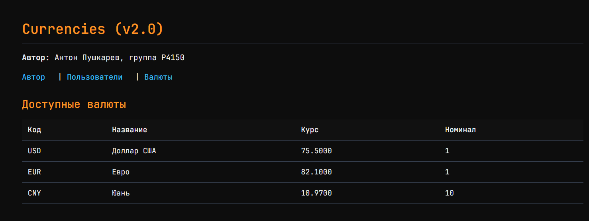
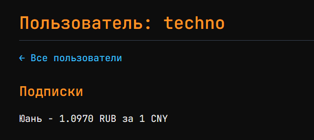
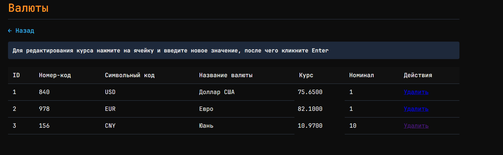
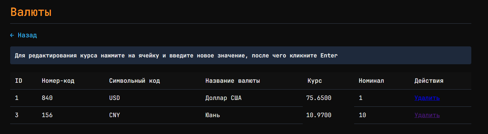
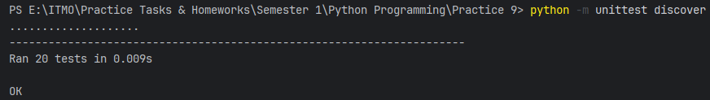

# Отчёт по ЛР №9

> **Работу выполнил:** Пушкарев Антон Дмитриевич, P4150

## Цель работы

Реализовать клиент-серверное приложение с возможностью хранения информации о валютах в СУБД с возможностью их
редактирования и удаления

## Описание моделей и их связей

- **App** - само приложение, поля: "name" (название - строка), "version" (версия - строка), "author" **(связь 1 к 1 с
  Author)**
- **Author** - автор приложения, поля: "name" (имя - строка), "group" (учебная группа - строка)
- **Currency** - валюта, поля: "id" (натуральное число), "num_code" (цифровой код ЦБ - строка), "char_code" (символьный
  код валюты - строка), "name" (название валюты - строка), "value" (курс валюты - вещ. число), "nominal" (номинал
  валюты - целое число)
- **User** - пользователь приложения, поля: "id" (натуральное число), "name" (имя пользователя - строка)

## Структура проекта

```bash
Practice 8/
├── models/ # директория с моделями предметной области
│ ├── init.py
│ ├── app.py
│ ├── author.py
│ ├── currency.py
│ ├── user.py
│ └── user_currency.py
├── templates/ # views (здесь содержатся шаблоны)
│ ├── author.html # страница об авторе
│ ├── currencies.html # страница со всеми валютами
│ ├── index.html # главная страница
│ ├── user.html # страница, где отображается информация о валютах конкретного пользователя
│ └── users.html # страница со списком пользователей
├── controllers/ # контроллеры
│ ├── currency_controller.py # обёртки над функциями из currency_db.py для реализации CRUD (для валюты)
│ ├── currency_db.py # функции для непосредственной работы с СУБД SQLite (для валюты)
│ ├── user_currency_controller.py # обёртки над функциями из currency_db.py для реализации CRUD (для валют пользователей)
│ ├── user_currency_db.py # функции для непосредственной работы с СУБД SQLite (для валют пользователей)
│ ├── user_controller.py # обёртки над функциями из currency_db.py для реализации CRUD (для пользователей)
│ ├── user_db.py # функции для непосредственной работы с СУБД SQLite (для пользователей)
│ ├── pages_controller.py # контроллер страниц, который вызывает рендеринг шаблонов
├── static/ # статика
│ ├── styles.css # стили
│ └── edit_currency.js # скрипт для асинхронного редактирования курса валют
├── utils/
│ ├── init.py
│ ├── database.py # функции для инициализации СУБД SQLite
├── myapp.py # основной файл, откуда запускается сервер и происходит маршрутизация
├── tests/
│ ├── init.py
│ ├── test_models.py # тесты моделей
│ ├── test_user_controller.py # тест контроллера пользователей
│ ├── test_user_currency_controller.py # тест контроллера валют пользователей (подписок)
│ ├── test_currency_controller.py # тест контроллера валюты
│ └── test_pages_controller.py # тесты рендеринга страниц
├── screenshots/ # скриншоты работы приложения для отчёта
└── Отчёт.md # отчёт
```

## Реализация CRUD

> В качестве примера рассмаотривается сущность Currency

| Операция   | SQL-запрос                                                                               |
|------------|------------------------------------------------------------------------------------------|
| **CREATE** | `INSERT INTO currency(num_code, char_code, name, value, nominal) VALUES (?, ?, ?, ?, ?)` |
| **READ**   | `SELECT * FROM currency`                                                                 |
| **UPDATE** | `UPDATE currency SET value = ? WHERE char_code = ?`                                      |
| **DELETE** | `DELETE FROM currency WHERE id = ?`                                                      |

Запросы в целях защиты от SQL-инъекций параметризуются

## Скриншоты страниц

### Главная страница (`/`)



Информация об авторе и таблица валют

### Валюты пользователя (`/user?id=...`)



### Таблица валют (`/currencies`)



Курс обновляется при изменении его непосредственно в поле в таблице

### Удаление валюты



Курс удаляется при нажатии на кнопку "Удалить"

## Тестирование

### Были написаны следующие тесты:

- с `unittest.mock`- unit-тесты контроллеров;
- с `:memory:` SQLite - CRUD-тесты

### Результат



## Выводы

1) Паттерн MVC позволил разделить данные, бизнес-логику и отображение сущностей в UI
2) Работа с SQLite производилась локально (т.е. данные СУБД хранятся в папке на диске, и такое решение подойдёт для
   небольшого кол-ва данных)
3) Параметризованные запросы позволяют защитить БД от SQL-инъекций
4) Обработка маршрутов производилась при помощи проверки адреса в myapp.py - и в случае, если ни один из адресов не
   подходит, выбрасывается ошибка 404
5) Рендеринг шаблонов был вынесен в отдельный контроллер - pages.py, что позволило немного упростить логику отрисовки в
   основном файле приложения (myapp.py)