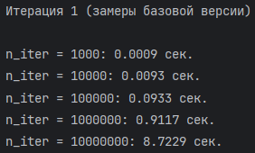
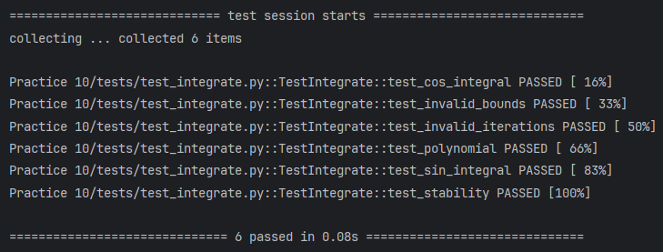
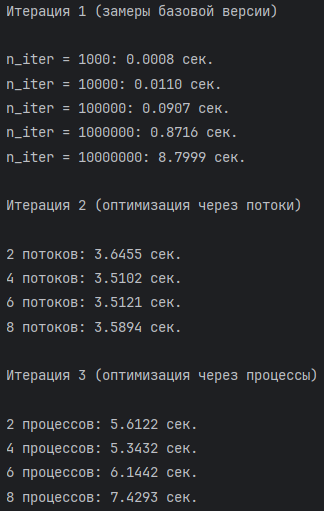
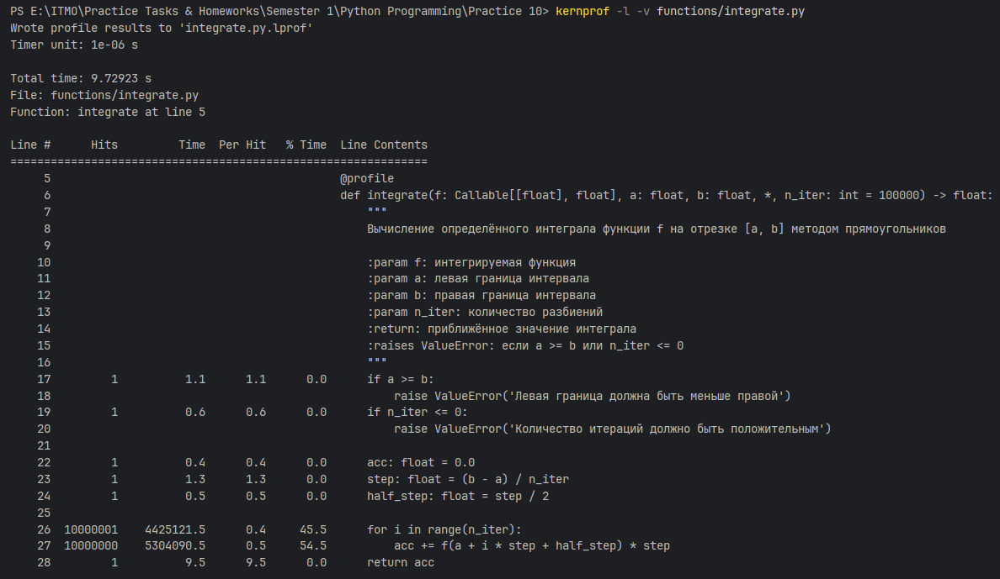
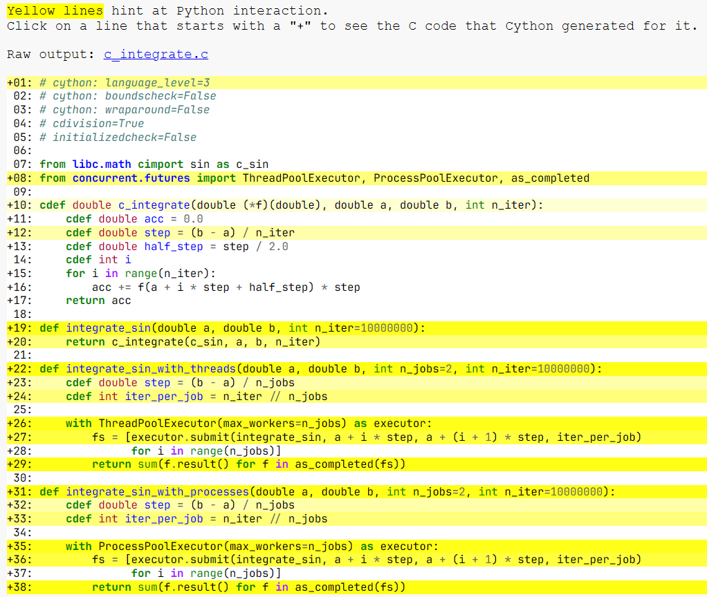
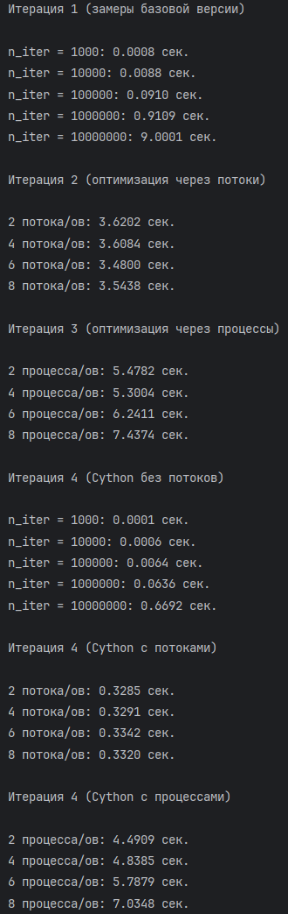
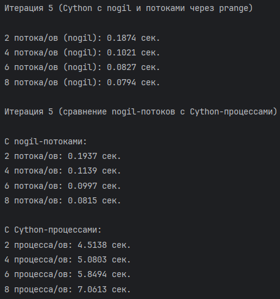
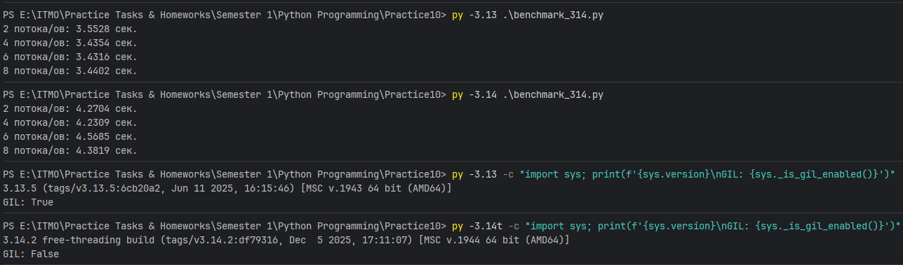

# Лабораторная работа №10

> **Выполнил:** Пушкарев Антон Дмитриевич

> Примечание:
> - Использован метод центральных, а не левых точек (для повышения точности вычисления)

## Итерация №1

**Представлены результаты выполнения функции integrate в однопоточном режиме без всяких оптимизаций:**

**Тесты данной функции были пройдены успешно:**

## Итерации №2, №3

**Добавлены оптимизированные версии через процессы и потоки:**

Исходя из вышеперечисленных результатов, можно сказать следующее:

- накладные расходы на создание процессов даже на 10 миллионах разбиений не позволяют показать особо большую
  эффективность в сравнении с обычной однопоточной версией: это заметно исходя из того, что по мере роста процессов
  результат ухудшается
- несмотря на то, что в данной итерации используется интерпретатор Python версии 3.13 и GIL заблокирован, многопоточная
  версия справляется с вычислением интеграла лучше всего; могу предположить, что это может быть связано с механизмом
  библиотеки math, некоторые вызовы функций которой (написанные на C) временно освобождают GIL, позволяя другим
  Python-потокам
  выполняться параллельно

## Итерация №4

**Во-первых, было проведено профилирование функции integrate. Результаты:**

Исходя из результатов выполнения, большая часть времени ушла на вычисление аккумулированного значения внутри смысла.
Имеет смысл переписать функцию, используя нативные переменные C (cdef).

**Функция была переписана с использованием кода на C и с помощью команды `python setup.py`
скомпилирована с просмотром отчёта в html**

Отчёт показывает, что взаимодействие с python-кодом производится по большей части в функциях-обёртках, а те слабые
места, которые
присутствовали в исходной версии integrate, переписаны с использованием C. Функции-обёртки нужны для вызова в бенчмарке.
Последующие оптимизации не дали лучшего результата (самая долговыполняющаяся строка уже достаточно "белая"), поэтому и
не были включены в отчёт.

**Ниже приведены результаты бенчмарка для Cython-модернизированной версии**

1) Скорость работы оптимизированной через Cython функции в однопоточном режиме хорошо заметна на 10 миллионах разбиений:
   отработала почти в 12 раз быстрее, чем исходная версия (0.7 сек против 8.5)
2) Также были написаны 2 функции для демонстрации многопоточной и многопроцессной
   версии в сравнении с этими же версиями на чистом Python. Результаты замеров показывают, что Cython даже с наличием
   GIL показывает повышение производительности вычислений примерно в 10 раз - во многом, из-за оптимизации внутреннего
   цикла. Версия с процессами хоть и быстрее, чем аналогичная на чистом Python, тем не менее, показывает
   неудовлетворительный результат из-за всё ещё высоких накладных расходов.

## Итерация №5

**В данной итерации было выполнено отключение GIL и сравнение многопоточной Cython-версии с обычными процессами
Cython**

Сравнение показывает, что многопроцессорные вычисления по-прежнему ресурсоёмки (вероятнее всего, из-за механизма
создания процессов в Windows 11). Многопоточные же вычисления с nogil пока что демонстрируют наилучшие результаты на 10
миллионах разбиениях. Например, если сравнить nogil-потоки с обычными cython-потоками, время выполнения кода уменьшается
в 4 раза!

## Дополнительные задания

### Возможность рассмотрения примитивов синхронизации

На мой взгляд, примитивы синхронизации в данной задаче не требуются. И процессы, и потоки работают на отдельных
подинтервалах интегрирования; суммирование же результата происходит в конце (когда Future-объект отдаст свой
результат). То есть, нет общей переменной или структуры данных, где происходит подсчёт информации одновременно.

### Применение Python 3.14

Для проверки возможностей разблокированного GIL был установлен интерпретатор Python 3.14

**Многопоточная версия функции integrate() была вызвана с помощью разных интерпретаторов:**

Достаточно интересен тот факт, что при одинаковом программном коде free-threaded версия показывает более медленный
результат, чем версия 3.13 с работающим GIL. Чем именно объясняется данный результат, сказать в настоящий момент
затруднительно, но могу предположить, что из-за того, что данная функциональность была добавлена недавно, она ещё
недостаточно
оптимизирована, в отличие от Cython, и присутствует некий оверхэд.
